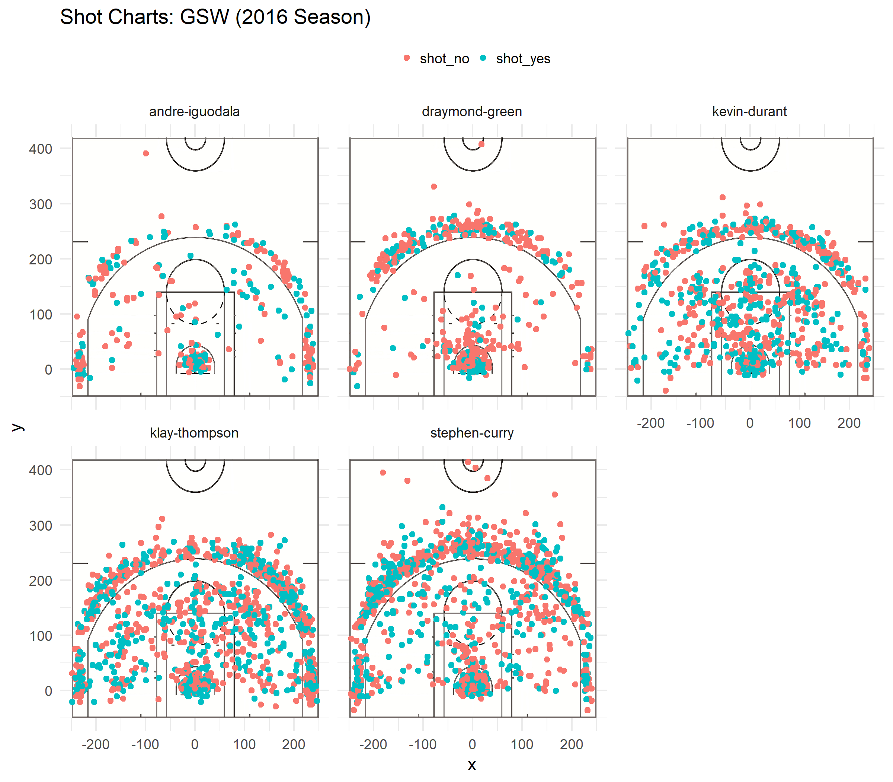

Workout 1
================
MNevins
March 10, 2019

<h1>
Golden State Warriors and Their Shooting Statistics
</h1>

<h3>
A report by Mark Nevins
</h3>

#### Motivation

I was contacted by a prestigious sports media company, Stat-133-Ltd, to write up a piece analyzing several players from the GSW and their stats. The statistics show not only the indiviudal player's strengths, and thus why the GSW is so good right now, but also something.

#### Background

The Golden State Warriors are one of the most valuable basketball teams of all time, winning three of the last four NBA championships. As such, statistical analysis is an incredibly important tool to discover why this team is so great, especially in regards to the players on the team. In this report we look at the Effective Shooting percentages of Andre Iguodala, Draymond Green, Kevin Durant, Klay Thompson, and Stephen Curry to see their individual strengths and what that means for the team.

#### Data

Here we can see the effective shot percentages by player for the given members of the Golden State Warriors analyzed:

| player         |  total|  made|  perc\_made|
|:---------------|------:|-----:|-----------:|
| kevin-durant   |    915|   495|       0.541|
| andre-iguodala |    371|   192|       0.518|
| klay-thompson  |   1220|   575|       0.471|
| stephen-curry  |   1250|   584|       0.467|
| draymond-green |    578|   245|       0.424|

. This can be broken down into the two- and three-point shots and their effective percentages.

| player         |  total\_twopt|  madetwo|  perctwomade|
|:---------------|-------------:|--------:|------------:|
| andre-iguodala |           210|      134|        0.638|
| kevin-durant   |           643|      390|        0.607|
| stephen-curry  |           563|      304|        0.540|
| klay-thompson  |           640|      329|        0.514|
| draymond-green |           346|      171|        0.494|

for the two point shots and

| player         |  total\_threept|  madethree|  percthreemade|
|:---------------|---------------:|----------:|--------------:|
| klay-thompson  |             580|        246|          0.424|
| stephen-curry  |             687|        280|          0.408|
| kevin-durant   |             272|        105|          0.386|
| andre-iguodala |             161|         58|          0.360|
| draymond-green |             232|         74|          0.319|

for the three point shots. Additionally, here is a graph of every shot attempted in the 2016 season for the five players, and whether or not it was a success. 

#### Analysis

As we can see from the shot tables, even though Andre Iguodala attempts the least amount of shots by far, he has the second highest successful shot percentage and the highest two-point shot success percentage. This makes sense, considering Andre Iguodala is a Small Forward on the Golden State Warriors. The other player with a notably small amount of total shots attempted, Draymond Green, actually has the lowest shot made percentage in every category! This could be attributed to his position as a Power Forward, which apparently spends part of their time defending. In general, the percentage of successful shots is much lower for the three-point shots when compared to the two-point shots, which is obvious due to the fact that three-point shots must be done much further back than two-point shots. However, for every player except Draymond Green it seems that there is no correlation between where in the two-point zone the shot was attempted and the chance of the shot making it. Draymond Green is the only outlier here where most two-point shots are considered a failure unless it was attempted directly under the hoop, suggeseting a possible weakness in shooting.

#### Conclusions

While this piece has ended up apparently critical of Draymond Green, I do not believe that to be the case. His statistics might look bad, but that is simply due to comparing him to other members of what could be considered to be the best basketball team of our time. When compared to other players, especially in his position, his data might look average, or even better than most other players. Additionally, one issue with this analysis is that each shot's external conditions were not displayed in the graphs, such as what team they were against and how long they had to make the shot. Some teams are better than others, and so making a shot against better teams turns out to be much harder, lowering your shot percentage even if you can always land the shot against easier teams. Another issue with this statistical analysis could be the fact I have no idea about any details about basketball, and so most of these conclusions are purely data-based and might not have any basis in reality.

#### References

Several Wikipedia pages on basketball so I think I know what this data means.

Data retrieved from <https://github.com/ucb-stat133/stat133-hws/tree/master/data>.
